# Complete guide on MCPTool commands

List of current MCPTool commands.

- [Help](#help)
- [Server](#server)
- [Uuid](#uuid)
- [IPInfo](#ipinfo)
- [IPHistory](#iphistory)
- [DNSLookup](#dnslookup)
- [Checker](#checker)
- [Resolver](#resolver)
- [Seeker](#seeker)
- [WebSearch](#websearch)
- [Subdomains](#subdomains)
- [Scan](#scan)
- [Listening](#listening)
- [Proxy](#proxy)
- [FakeProxy](#fakeproxy)
- [Connect](#connect)
- [SendCMD](#sendcmd)
- [Rcon](#rcon)
- [BruteRcon](#brutercon)
- [BruteAuth](#bruteauth)
- [Kick](#kick)
- [KickAll](#kickall)
- [Password](#password)
- [Discord](#discord)
- [Language](#language)
- [Settings](#settings)
- [ClearServers](#clearservers)
- [Debug](#debug)
- [Clear](#clear)

## Help

The **help** command allows you to get information about the commands available in the tool.

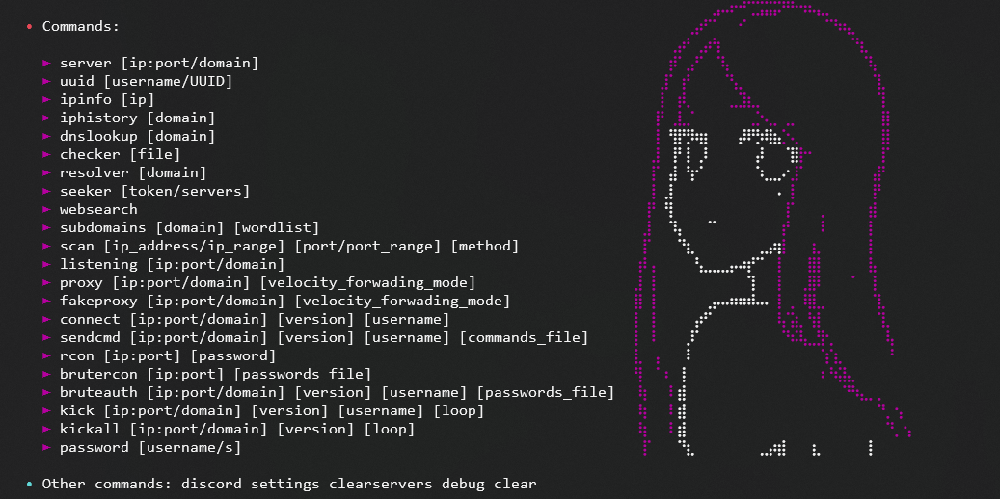

## Server

The **server** command allows you to obtain information about a Minecraft server. Works on Java and Bedrock servers.

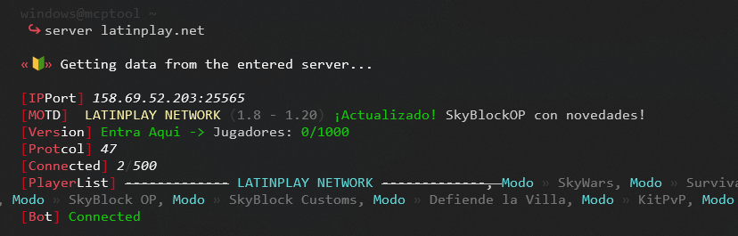

To use this command you must enter:
 
`server <ip:port/domain>`

## Uuid

The **uuid** command allows you to get the uuids of a Minecraft user or premium user using their uuid

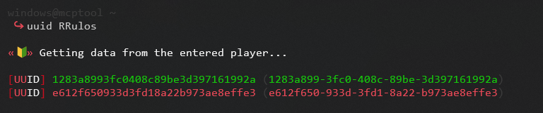

To use this command you must enter:
 
`uuid <username>`

## IPInfo
The **ipinfo** command allows you to get information about an IP address.

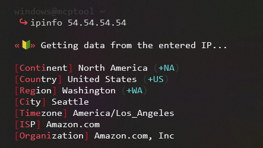

To use this command you must enter:
 
`ipinfo <ip>`

## IPHistory
The **iphistory** command allows you to obtain the IP address history of a domain.

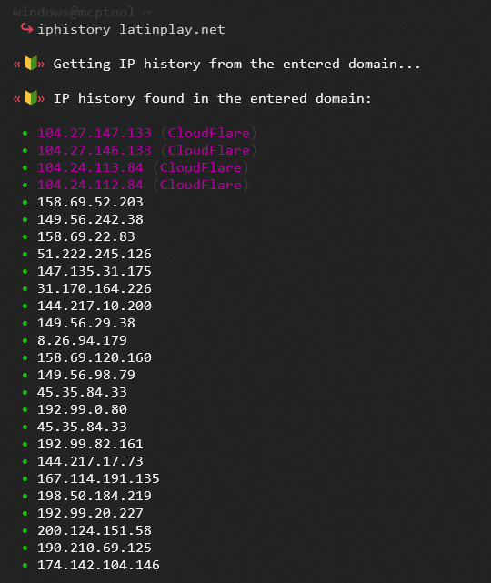

To use this command you must enter:
 
`iphistory <domain>`

## DNSLookup
The **dnslookup** command allows you to obtain the DNS information of a domain.

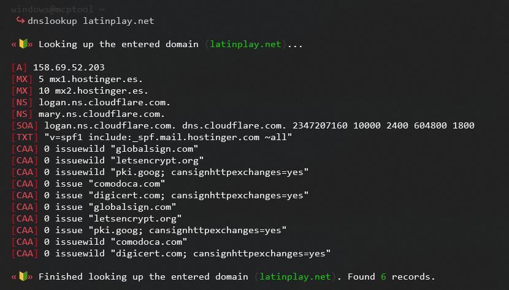

To use this command you must enter:
 
`dnslookup <domain>`

## Checker
The **checker** command allows you to check the status of a Minecraft server from a list of servers in a file.

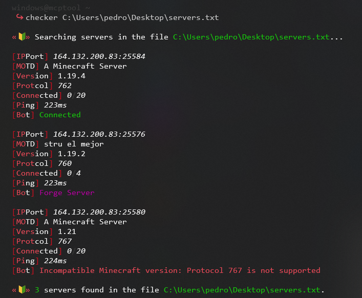

To use this command you must enter:
 
`checker <file>`

## Resolver
The **resolver** command allows you to get the subdomains of a domain.

To use this command you must enter:
 
`resolver <domain>`

## Seeker [token]
The **seeker token** command allows you to get a token to use the seeker API.

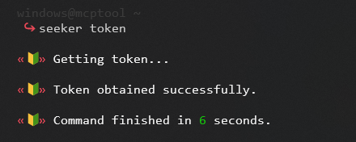

To use this command you must enter:
 
`seeker token`

## Seeker [servers]
The **seeker servers** command allows you to search for a minecraft servers using the seeker API.

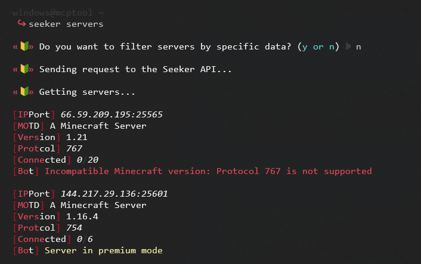

To use this command you must enter:
 
`seeker servers`

## WebSearch
The **websearch** command allows you to search for minecraft servers on the multiple websites.

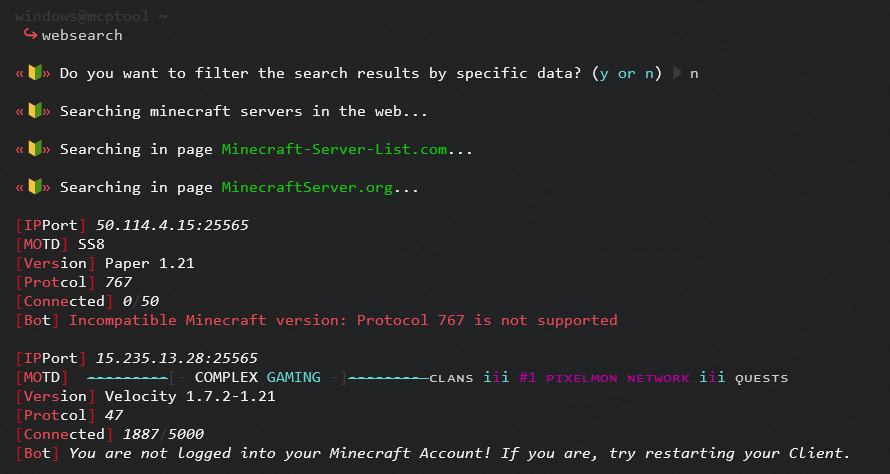

To use this command you must enter:
 
`websearch`

## Subdomains
The **subdomains** command allows you to get the subdomains of a domain using a wordlist.

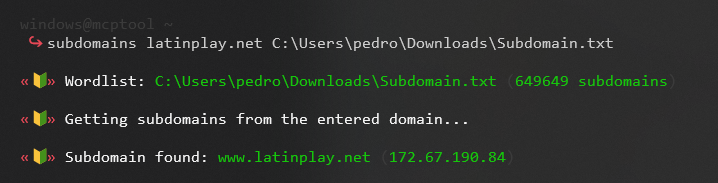

To use this command you must enter:
 
`subdomains <domain> <wordlist>`

## Scan
The **scan** command allows you to perform a scan to look for open ports hosting Minecraft servers.

#### **IP Range**

You can enter a normal IP like **127.0.0.1**.

But you can also enter an IP range, such as: **127.0.0.1-255**

Valid formats for IP ranges vary depending on the type of scanner you select.

#### **Port Range**

You can enter a normal port like **25565**.

But you can also enter a variety of ports, such as: **25560-25570**

Valid formats for port ranges vary depending on the type of scanner you select.

#### **Scanner**.

You can perform the scan using different scanners, this is specified in the **method** argument

List of methods:

- Nmap (nmap)
- Quboscanner (qubo)
- Masscan (masscan)
- Python Sockets (py)

In the **method** argument you can enter the name of the scanner or its respective number.

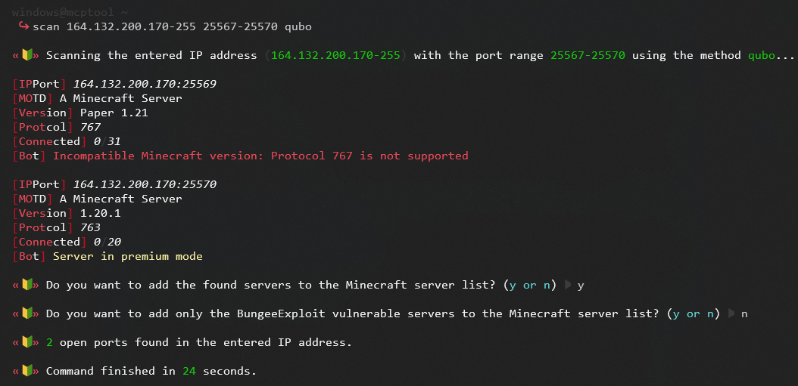

To use this command you must enter:
 
`scan <ip> <ports> <method>`

## Listening
The **listening** command allows you to listen to the connections of a Minecraft server.

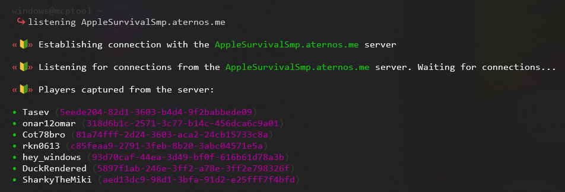

To use this command you must enter:
 
`listening <ip:port/domain>`

## Proxy
The **proxy** command allows you to create a proxy server to connect to a Minecraft server.

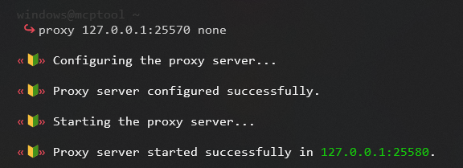
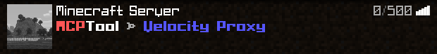

To use this command you must enter:
 
`proxy <ip:port/domain> <forwarding_mode>`

# FakeProxy
The **fakeproxy** command allows you to create a fake proxy server.
More information about this command can be found [here](./fakeproxy.md).

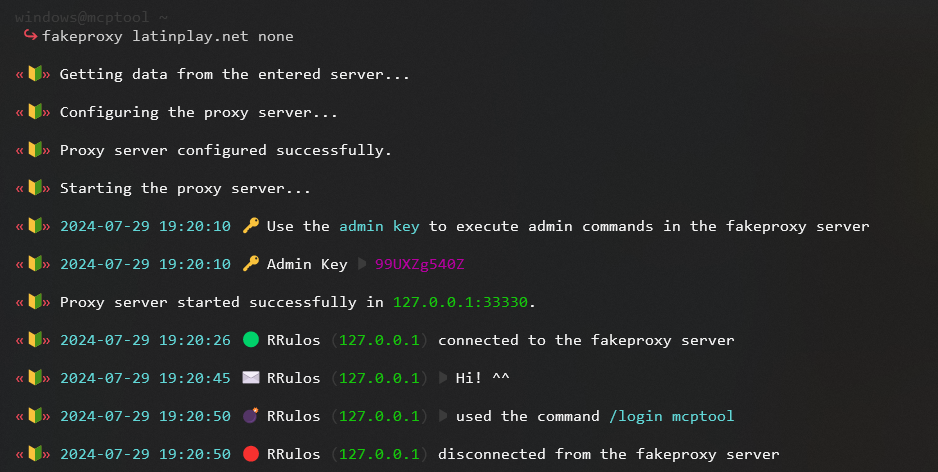
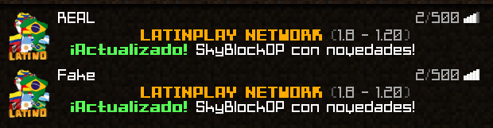

To use this command you must enter:
 
`fakeproxy <ip:port/domain> <forwarding_mode>`

## Connect
The **connect** command allows you to connect to a Minecraft server.

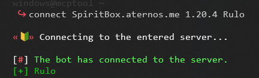

To use this command you must enter:
 
`connect <ip:port/domain> <version> <username>`

## SendCMD
The **sendcmd** command allows you to send a bot to a Minecraft server to send messages or commands.

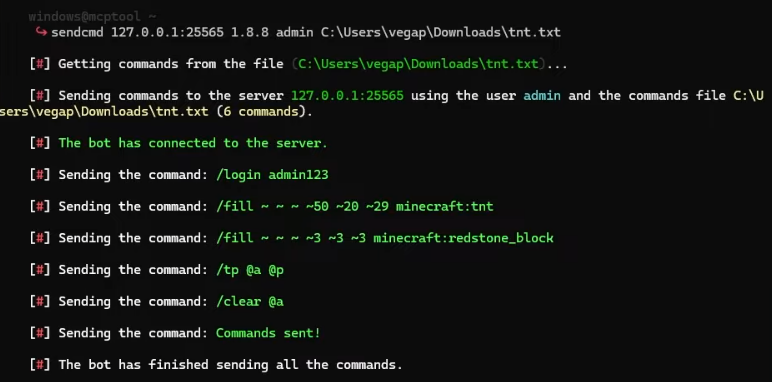

To use this command you must enter:
 
`sendcmd <ip:port/domain> <version> <username> <commandsFile>`

## Rcon
The **rcon** command allows you to connect to a Minecraft server using the RCON protocol.

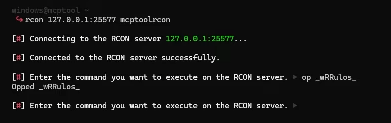

To use this command you must enter:
 
`rcon <ip:rconPort> <password>`

## BruteRcon
The **brutercon** command allows you to perform a brute force attack on the RCON protocol of a Minecraft server.

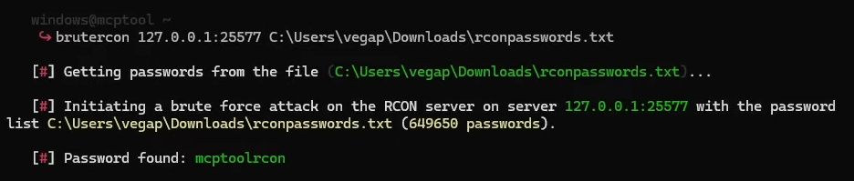

To use this command you must enter:
 
`brutercon <ip:rconPort> <passwordsFile>`

## BruteAuth
The **bruteauth** command allows you to perform a brute force attack on the authentication plugin of a Minecraft server.

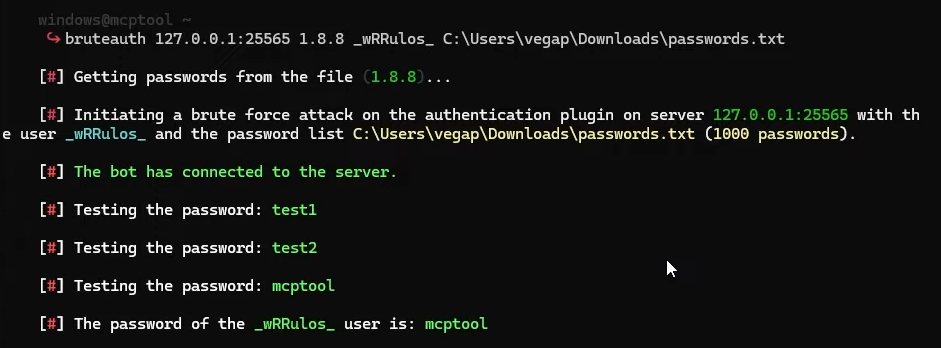

To use this command you must enter:
 
`bruteauth <ip:port/domain> <version> <username> <passwordsFile>`

## Kick
The **kick** command allows you to kick a player from a Minecraft server.

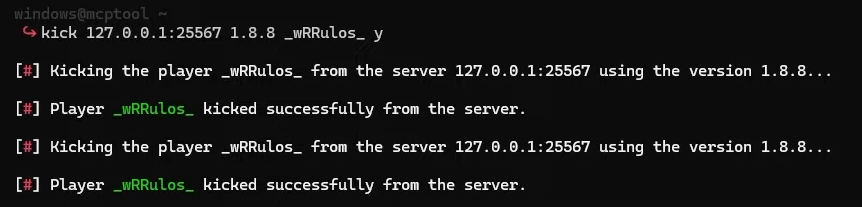

To use this command you must enter:
 
`kick <ip:port/domain> <version> <username> <loop>`

## KickAll
The **kickall** command allows you to kick all players from a Minecraft server.

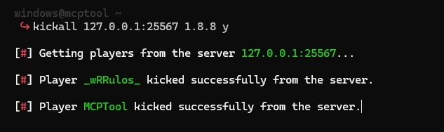

To use this command you must enter:
 
`kickall <ip:port/domain> <version> <loop>`

## Password
The **password** command allows get the password of a username using the Nordify API.

To use this command you must enter:
 
`password <username>`

## Discord
The **discord** command allows you to get my discord server invite link.

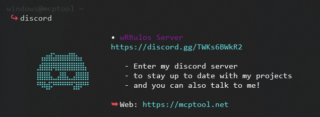

To use this command you must enter:
 
`discord`

## Settings (Windows only)
The **settings** command allows you to change the settings of the tool.

Settings available:
- **settings** - MCPTool main settings
- **proxy** - Proxy settings
- **scanner** - Scanner settings
- **bruteforce_settings** - Brute force settings
- **sendcmd_settings** - SendCMD settings
- **mcserver-scrapper** - McServer Scrapper settings (websearch)
- **nordify** - Nordify account settings

## Language
The **language** command allows you to change the language of the tool.

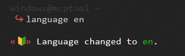

To use this command you must enter:
 
`language <language>`

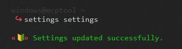

To use this command you must enter:
 
`settings <setting>`

## ClearServers
The **clearservers** command allows you to clear the list of servers saved in the multiplayer server list.

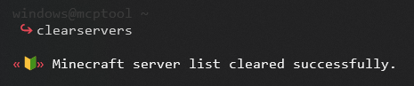

To use this command you must enter:
 
`clearservers`

## Debug
The **debug** command allows you to enable or disable the debug mode.

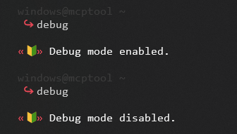

To use this command you must enter:
 
`debug`

## Clear
The **clear** command allows you to clear the console.